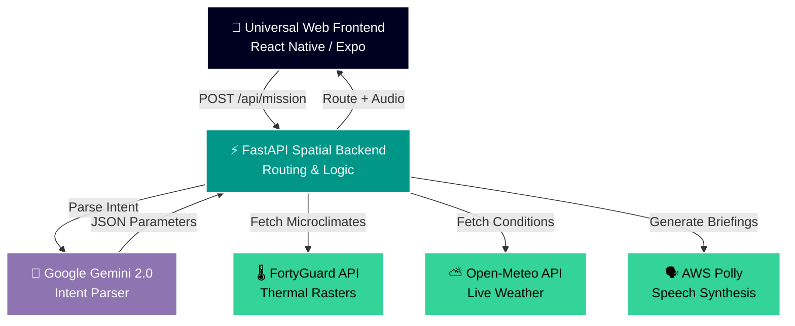

<div align="center">
  

  # 🌡️ CoolPath: Climate-Resilient Navigation System
  
  **AI-Powered Microclimate Routing for Extreme Urban Heat**

  [](coolpath/backend)
  [](coolpath/frontend)
  [](coolpath/backend)
  [](fortyguard)

  <p align="center">
    <i>Protecting pedestrians, runners, and cyclists from scorching sun-exposed asphalt by routing them into shade-rich, microclimate-cooled pathways.</i>
  </p>
</div>

<hr/>

## ✨ Why CoolPath?

Urban heat islands are increasingly dangerous. **CoolPath** is a state-of-the-art, heat-aware microclimate navigation engine built for modern cities. Powered by high-resolution thermal rasters from **FortyGuard**, AI mission planning via **Google Gemini 2.0**, and human thermodynamic physiological modeling, CoolPath ensures that your journey is not just fast, but thermally safe.

## 🚀 Key Features

<table>
  <tr>
    <td width="50%">
      <h3>🌳 Multi-Objective Heat & Shade Optimization</h3>
      <p>Multi-objective Pareto routing solver (Fastest vs. Shaded vs. Balanced) combining OpenStreetMap topological street networks with FortyGuard spatial heat rasters.</p>
    </td>
    <td width="50%">
      <h3>⚡ Sub-Millisecond Spatial Indexing</h3>
      <p>Utilizes Shapely <code>STRtree</code> point-in-polygon bounding box search for instant spatial microclimate lookups across thousands of grid tiles.</p>
    </td>
  </tr>
  <tr>
    <td width="50%">
      <h3>🧬 Human Thermodynamic Modeling</h3>
      <p>Real-time simulation of traveler core body temperature, metabolic energy expenditure (METs), convective wind cooling, and humidity evaporative limits.</p>
    </td>
    <td width="50%">
      <h3>🤖 AI Assistant & Voice Briefings</h3>
      <p>Gemini 2.0 agent parses natural language intent ("Find me a shaded 5km running path") and generates audio briefings via AWS Polly.</p>
    </td>
  </tr>
  <tr>
    <td width="50%">
      <h3>📈 Online Machine Learning Feedback</h3>
      <p>Online <code>SGDClassifier</code> adapts route recommendations dynamically based on user Thumbs Up / Down ratings.</p>
    </td>
    <td width="50%">
      <h3>📱 Universal Frontend Architecture</h3>
      <p>Unified Expo React Native architecture that seamlessly compiles to a highly responsive web application.</p>
    </td>
  </tr>
</table>

## 🧠 System Architecture

We designed CoolPath to be highly scalable and decoupled, utilizing a lightweight Python backend and a blazing-fast universal frontend.



## 🧮 Thermodynamic Physics Model

CoolPath computes core body temperature $T_{\text{core}}$ using the human stored thermal heat equation:

$$T_{\text{core}}(t+\Delta t) = T_{\text{core}}(t) + \frac{Q_{\text{stored}}}{m \cdot c} \Delta t$$

Where:
- $Q_{\text{stored}} = Q_{\text{metabolic}} - Q_{\text{work}} - Q_C - Q_R - Q_E$
- **Metabolic Rate ($Q_{\text{metabolic}}$)**: $\text{MET} \times 58.15 \times A_{\text{DuBois}}$
- **Stefan-Boltzmann Radiation ($Q_R$)**: Accounts for pavement $T^4$ thermal emission. Shade tree canopy routing cuts $Q_R$ direct solar flux by up to **85%**.
- **Convective Loss ($Q_C$)**: $h_c \cdot (T_{\text{skin}} - T_{\text{ambient}}) \cdot A_{\text{DuBois}}$ where $h_c = 8.3 \sqrt{v_{\text{wind}}}$.

## 📁 Repository Structure

```text
temperature-api-quickstart/
├── coolpath/
│   ├── backend/                 # Python FastAPI Microclimate & AI Backend
│   │   ├── app/
│   │   │   ├── agent/           # Gemini 2.0 Intent Parser & Prompt Logic
│   │   │   ├── api/             # REST Endpoints (/api/mission)
│   │   │   ├── data/            # OSM Topology & Microclimate Cache
│   │   │   ├── ml/              # Online SGD Preference Learning Model
│   │   │   └── services/        # FortyGuard, NetworkX Solver, AWS Polly
│   │   ├── Dockerfile           # Docker container build specification
│   │   └── render.yaml          # Render 1-Click Infrastructure Blueprint
│   ├── frontend/                # Universal Expo Web Application
│   │   ├── src/                 # Web Map & Dashboard Components
│   │   ├── assets/              # App Icons, Fonts & Sounds
│   │   ├── app.json             # Expo App Manifest Configuration
│   │   └── package.json         # Frontend Dependencies
│   └── .gitignore               # Unified CoolPath Git Exclusion Rules
├── fortyguard/                  # SDK Client Package for FortyGuard tOS API
├── docs/                        # Engineering Specifications & Formulas
└── start.py                     # Universal 1-Command Developer Launcher
```

## 🛠️ Quickstart

### 1-Command Boot
To launch both the **FastAPI Backend** and the **Expo Web Frontend** automatically with port conflict resolution:
```bash
python start.py
```
> **Note**: The launcher automatically detects available ports, boots Uvicorn, configures the frontend API endpoint, and opens the Expo web server.

### Manual Setup
<details>
<summary><b>1. Backend Setup (FastAPI)</b></summary>
<br/>

```bash
cd coolpath/backend
python3 -m venv venv
source venv/bin/activate  # Windows: venv\Scripts\activate
pip install -r requirements.txt
```

**Environment Variables (`coolpath/backend/.env`)**:
```env
GEMINI_API_KEY=your_google_gemini_api_key
FORTYGUARD_API_KEY=your_fortyguard_api_key
AWS_ACCESS_KEY_ID=your_aws_key_optional
AWS_SECRET_ACCESS_KEY=your_aws_secret_optional
DEMO_MODE=False
```

**Run**:
```bash
uvicorn app.main:app --host 0.0.0.0 --port 8000 --reload
```
</details>

<details>
<summary><b>2. Frontend Setup (Expo Web)</b></summary>
<br/>

The frontend is now a unified Expo universal app serving responsive web.

```bash
cd coolpath/frontend
npm install
```

**Environment Variables (`coolpath/frontend/.env.local`)**:
```env
EXPO_PUBLIC_MAPBOX_TOKEN=your_mapbox_token
EXPO_PUBLIC_NGROK_BACKEND_URL=http://localhost:8000
```

**Run Web Server**:
```bash
npx expo start --web
```
</details>

## ☁️ Deployment

### Render (Backend)
1. Push this repository to GitHub.
2. Go to [dashboard.render.com](https://dashboard.render.com/) and click **New +** $\rightarrow$ **Blueprint**.
3. Select your repository. Render will automatically process `coolpath/backend/render.yaml`.
4. Enter your environment variables in the Render Dashboard and click **Apply**.

---

<div align="center">
  <sub>Built with ❤️ for a cooler, safer urban future.</sub>
</div>
